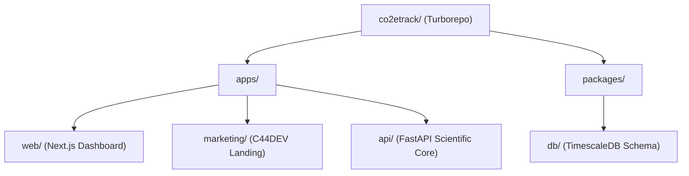

# CO2etrack // CCUS Traceability Platform

Professional, regulator-defensible carbon accounting and molecular-level traceability system built for **C44DEV SA (Geneva)**.

## 🏗️ Architecture: High-Fidelity Monorepo



## 🛠️ Core Scientific Pillars

1.  **Molecular Provenance**: Physical-digital linkage using patented chemical markers detected at every value chain node.
2.  **Uncertainty Engine**: Monte Carlo (N=10,000) simulations providing 95% Confidence Intervals (P95) for all removal batches.
3.  **Digital MRV**: Automated issuance of W3C Verifiable Credentials for cryptographically secure carbon certificates.

## 🚀 Getting Started

### Prerequisites
- Node.js 24 + Bun
- Python 3.12 (with SciPy/Pandas)
- PostgreSQL (with TimescaleDB extension)

### Development
```bash
# Install dependencies
npm install

# Start all modules (Web, Marketing, API)
npm run dev
```

## 🛡️ Professional Readiness
- **ISO 14064-1/2** methodology alignment.
- **Eu ETS / Verra** registry compatibility.
- **SOC 2 Type 1** security controls (RLS isolation, Audit Logs).

---

**© 2026 C44DEV SA // Geneva, Switzerland**
